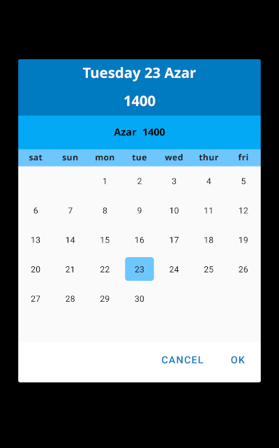
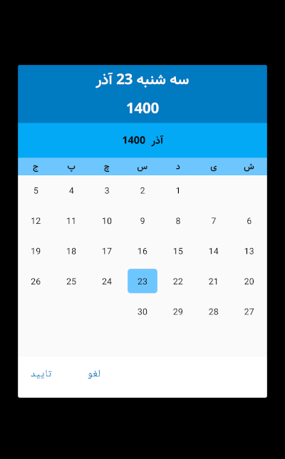

<h1 align="center">
 <a href="https://github.com/SkybirdBits/PersianDatePicker"> کتابخانه تقویم فارسی اندروید</a>
</h1>

[](https://jitpack.io/#skybirdbits/persiandatepicker)

یک کتابخانه ساده و کاربردی برای نمایش تقویم فارسی به صورت دیالوگ این کتابخانه همانند DatePicker در اندروید است که تاریخ شمسی را به صورت دیالوگ نمایش می دهد

افزودن کتابخانه به پروژه
----

**مرحله اول**

ابتدا jitpack را به کل پروژه اضافه کنید

 در فایل  **build.gradle** مربوط به روت پروژه کد زیر را وارد کنید


```groovy
    allprojects {
        repositories {
            ...
            maven { url "https://jitpack.io" }
        }
   }‍‍‍
```

  نسخه های جدید اندروید استادیو فایل settings.gradle


```groovy
    repositories {
        ...
        maven { url "https://jitpack.io" }
    }
```

**مرحله دوم**

  کتابخانه را اضافه کنید

  کد زیر را به فایل build.gradle مربوط به پوشه ی app قسمت dependencies اضافه کنید


```groovy
  dependencies {
        implementation 'com.github.skybirdbits:persiandatepicker:0.0.5'
   }
 ```


مثال
----

**ایجاد نمونه ی جدید**

 ```PersianDatePicker datePicker = new PersianDatePicker(context);```

 یا

 ```PersianDatePicker datePicker = new PersianDatePicker(context,viewGroup);```

**تنظیم حداقل و حداکثر تاریخ**

```java
datePicker.updateMinYear(1360);
datePicker.updateMaxYear(1450);
```

**تنظیم modal دیالوگ**
```java
datePicker.setDimAmount(0.5f);
```

**بستن Dialog و دریافت تاریخ با کلیک روی تایید**

```java
private PersianCalendar calendar;
datePicker.setOnPositiveButtonClickListener(timeMillis -> calendar = new PersianCalendar(timeMillis));

```

**تنظیم زبان تقویم به فارسی و لاتین**

```java
datePicker.setLanguageFarsi(true);
```

**نمایش تقویم**

```java
datepicker.show()
```

نمونه
----


